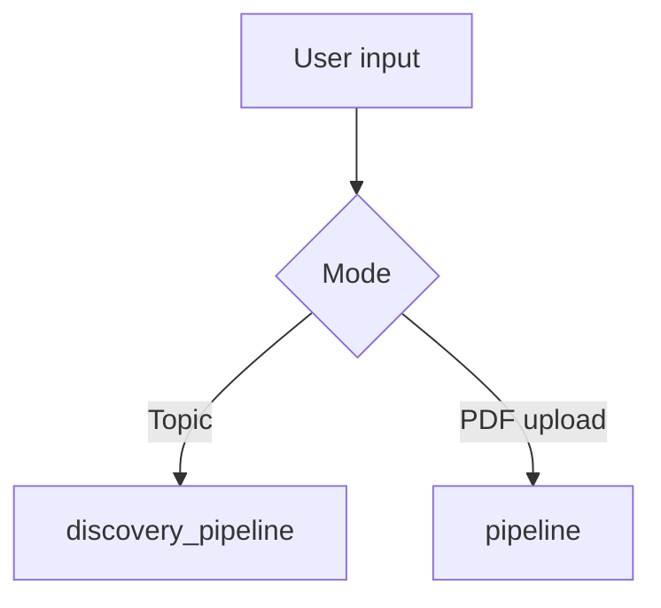
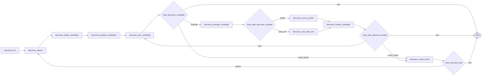
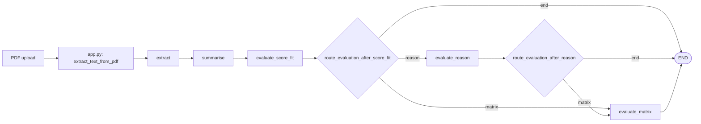

# Agent architecture

The app has **two LangGraph pipelines** sharing one typed state (`PaperState`):

1. **Topic-first discovery agent** (primary UX): user provides a topic; the orchestrator finds, evaluates, and qualifies journal works.
2. **PDF evaluator** (optional): user uploads PDFs; the system scores fit vs research focus (and can run a structured matrix step).

Both pipelines append structured trace steps for observability.

## Pipeline overview

Compiled graphs live in `paper_graph/pipeline.py` as singletons `pipeline` and `discovery_pipeline`.

## Topic discovery flow (primary)

The discovery graph is a **round loop** (search → triage → prepare → **candidate loop**) until enough qualified works or max rounds.

### Discovery node responsibilities

| Node | Responsibility |
|------|----------------|
| `discovery_init` | Initializes loop controls (`target_qualified_count`, round limits, cursor, lists). |
| `discovery_search` | Fetches one batch of candidates (e.g. OpenAlex) for the topic. |
| `discovery_triage_candidates` | LLM ranks the batch by abstract-only fit; may signal refetch. |
| `discovery_prepare_candidates` | Builds `candidate_queue` from triaged results. |
| `discovery_pick_candidate` | Pops one `current_candidate` (or empty → round boundary). |
| `discovery_evaluate_candidate` | **One LLM call** outputs `SCORE`, `FIT`, `QUALITY`, `REASON`. Results are **cached** per topic + work identity (see below). |
| `route_after_discovery_evaluate` | **Early exit:** skips matrix extraction when `FIT=NO` or score is below a floor (see `paper_graph/nodes.py`). |
| `discovery_eval_early_exit` | Trace step + empty `candidate_source_profile` when early exit applies. |
| `discovery_source_profile` | Evidence matrix: **rule-based** (metadata + reason only) when fit + score are high enough; otherwise **LLM** JSON extraction. Trace `result.profile_mode` is `rule` or `llm`. |
| `discovery_finalize_candidate` | Merges into `evaluated_candidates` / `qualified_works`; clears per-candidate scratch fields. |
| `discovery_round_check` | Round boundary; `route_discovery_loop` decides another search round or end. |

### Qualification and stop conditions

- A work is added to `qualified_works` when `fit`, `quality`, and `score >= 0.7` (see `discovery_finalize_candidate_node`).
- The graph ends when `target_qualified_count` is met, `max_discovery_rounds` is reached, or routing returns `end` (e.g. error path).

### Discovery efficiency knobs (implementation)

Constants live in `paper_graph/nodes.py` next to the discovery nodes:

| Idea | Mechanism |
|------|-----------|
| Single eval pass | `DISCOVERY_EVALUATE_CANDIDATE_PROMPT` replaces separate score + quality LLM steps. |
| Early exit after scoring | `route_after_discovery_evaluate` → `discovery_eval_early_exit` when `FIT=NO` or `score < DISCOVERY_EVAL_SKIP_PROFILE_BELOW_SCORE` (no profile LLM/rule work). |
| Cheap profile when confident | `_discovery_profile_confidence_high`: rule-based matrix when `FIT=YES` and `score >= DISCOVERY_PROFILE_RULE_SCORE_MIN`; else LLM profile. |
| Cache on retry / rerun | `_discovery_eval_cache_*`: keyed by topic + doi/url/title/abstract slice + version `DISCOVERY_EVAL_CACHE_VERSION`; bounded (`DISCOVERY_EVAL_CACHE_MAX`). Uses `st.session_state` when available. |

## PDF evaluator flow (optional)

### PDF node responsibilities

| Node | Responsibility |
|------|----------------|
| `extract` | Validates extracted text length; short-circuits invalid input. |
| `summarise` | Produces `summary`, `key_findings`, `methodology`. |
| `evaluate_score_fit` | Relevance `score` and `fit` vs research focus. |
| `evaluate_reason` | Optional narrative reason (`full` depth). |
| `evaluate_matrix` | Structured `source_profile` / evidence matrix from excerpts. |

## Shared state (`PaperState`)

`paper_graph/state.py` holds shared and mode-specific fields.

- **Core:** `filename`, `error`, `trace`
- **PDF:** `pdf_text`, `summary`, `key_findings`, `methodology`, `relevance_score`, `fit`, `relevance_reason`, `source_profile`
- **Discovery:** `topic`, `discovery_query`, `discovery_cursor`, `discovery_round`, `discovery_batch_size`, `max_discovery_rounds`, `target_qualified_count`, `discovered_candidates`, `candidate_queue`, `current_candidate`, `candidate_score`, `candidate_fit`, `candidate_quality`, `candidate_reason`, `candidate_source_profile`, `candidate_eval_duration_ms`, `evaluated_candidates`, `qualified_works`

## Provider strategy (OpenRouter + Gemini fallback)

All LLM calls go through `utils/gemini_llm.py` (`invoke_gemini_prompt`) with centralized controls:

- Minimum spacing between calls (`GEMINI_MIN_INTERVAL_SECONDS`)
- Retry count (`GEMINI_RETRY_COUNT`)
- Exponential backoff base (`GEMINI_RETRY_BACKOFF_SECONDS`)
- Quota/rate-limit detection + key fallback (`GEMINI_API_KEY_ALT`)
- OpenRouter is used first when configured (`OPENROUTER_API_KEY` + `OPENROUTER_MODEL`)
- Gemini remains available as fallback (`GEMINI_API_KEY`, optional `GEMINI_API_KEY_ALT`)

This keeps node work small, reduces bursty per-node spikes, and lets the orchestrator combine results under rate limits.

## Boundaries

- **Orchestration:** `paper_graph/pipeline.py`, `paper_graph/nodes.py`
- **LLM calls + throttling:** `utils/gemini_llm.py`
- **External journal search:** `utils/journal_search.py`
- **Prompts:** `utils/prompts.py`
- **Trace persistence:** `utils/trace_store.py` (MongoDB when configured)

This separation keeps causes clear: nodes stay focused, orchestration composes, and I/O adapters stay replaceable.
