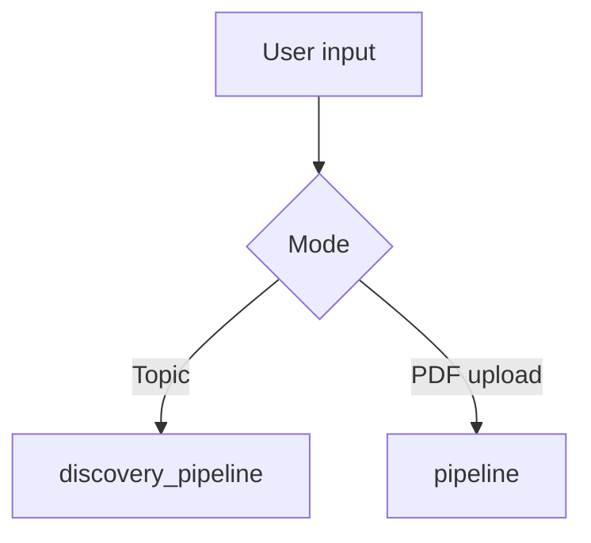
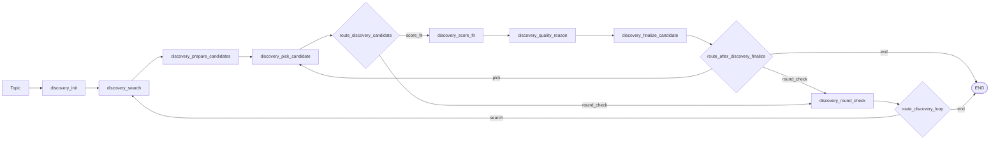
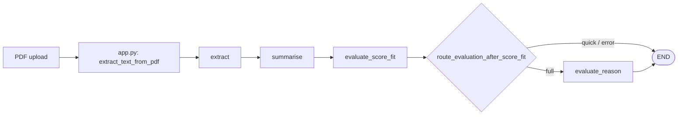

# Agent architecture

The app now has **two LangGraph pipelines** sharing one typed state (`PaperState`):

1. **Topic-first discovery agent** (primary UX): user provides a topic, orchestrator finds and qualifies top journal works.
2. **PDF evaluator** (optional): user uploads PDFs and the system scores fit vs research focus.

Both pipelines append structured trace steps for observability.

## Pipeline overview

Compiled graphs live in `graph/pipeline.py` as singleton `pipeline` and `discovery_pipeline`.

## Topic discovery flow (primary)

The discovery graph is a strict orchestrator with a **candidate loop inside a round loop**.

### Discovery node responsibilities

| Node | Responsibility |
|------|----------------|
| `discovery_init` | Initializes strict loop controls (`target_qualified_count`, round limits, cursor, lists). |
| `discovery_search` | Fetches one batch of journal candidates from external search provider. |
| `discovery_prepare_candidates` | Converts fetched batch into an evaluation queue. |
| `discovery_pick_candidate` | Pops exactly one candidate for evaluation. |
| `discovery_score_fit` | LLM step 1 for the candidate (`SCORE`, `FIT`). |
| `discovery_quality_reason` | LLM step 2 for the candidate (`QUALITY`, `REASON`). |
| `discovery_finalize_candidate` | Aggregates candidate result into `evaluated_candidates` and `qualified_works`. |
| `discovery_round_check` | Round boundary; routes to next search round or end. |

Qualification rule is enforced centrally in the orchestrator path:
- Candidate is kept when `fit == True` and `quality == True` and `score >= 0.7`.
- Process stops when:
  - at least `target_qualified_count` works are qualified (default 2), or
  - `max_discovery_rounds` is reached.

## PDF evaluator flow (optional)

### PDF node responsibilities

| Node | Responsibility |
|------|----------------|
| `extract` | Validates extracted text length and short-circuits invalid input. |
| `summarise` | Produces `summary`, `key_findings`, `methodology`. |
| `evaluate_score_fit` | Produces relevance `score` and `fit`. |
| `evaluate_reason` | Optional second evaluator step for narrative reason (`full` mode only). |

## Shared state (`PaperState`)

`graph/state.py` holds shared + mode-specific fields.

- **Core fields:** `filename`, `error`, `trace`
- **PDF fields:** `pdf_text`, `summary`, `key_findings`, `methodology`, `relevance_score`, `fit`, `relevance_reason`
- **Discovery fields:** `topic`, `discovery_query`, `discovery_cursor`, `discovery_round`, `discovery_batch_size`, `max_discovery_rounds`, `target_qualified_count`, `discovered_candidates`, `candidate_queue`, `current_candidate`, `candidate_score`, `candidate_fit`, `candidate_quality`, `candidate_reason`, `evaluated_candidates`, `qualified_works`

## Rate-limit strategy (Gemini + OpenRouter fallback)

All LLM calls go through `utils/gemini_llm.py` (`invoke_gemini_prompt`) with centralized controls:

- Minimum spacing between calls (`GEMINI_MIN_INTERVAL_SECONDS`)
- Retry count (`GEMINI_RETRY_COUNT`)
- Exponential backoff base (`GEMINI_RETRY_BACKOFF_SECONDS`)
- Quota/rate-limit detection + key fallback (`GEMINI_API_KEY_ALT`)
- Optional provider fallback to OpenRouter when Gemini quota/rate limits are exhausted (`OPENROUTER_API_KEY` + `OPENROUTER_MODEL`)

This keeps node work small, prevents bursty per-node call spikes, and lets the orchestrator combine results safely under free-tier limits.

## Boundaries

- **Orchestration:** `graph/pipeline.py`, `graph/nodes.py`
- **LLM calls + throttling:** `utils/gemini_llm.py`
- **External journal search:** `utils/journal_search.py`
- **Prompts:** `utils/prompts.py`
- **Trace persistence:** `utils/trace_store.py` (MongoDB when configured)

This separation keeps causes and responsibilities clean: nodes stay focused, orchestration composes, and I/O adapters remain replaceable.
