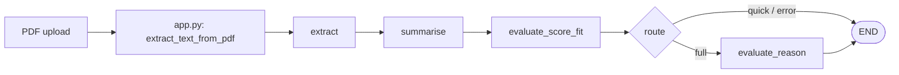

# Agent architecture

The research assistant is a **linear LangGraph** pipeline: three nodes share a single typed state (`PaperState`). PDF text is extracted **before** the graph runs; the first node only validates length and records trace metadata.

## Control flow

Entry point is `extract`; flow is `extract → summarise → evaluate_score_fit`, then conditional routing (`graph/nodes.route_evaluation_after_score_fit`): **`full`** runs `evaluate_reason` then `END`; **`quick`** (sidebar) skips the reason LLM and goes straight to `END`. The compiled graph lives in `graph/pipeline.py` as a singleton `pipeline`.

## State

`PaperState` (`graph/state.py`) carries:

| Field | Role |
|-------|------|
| `filename`, `pdf_text` | Input corpus |
| `summary`, `key_findings`, `methodology` | Structured output from summarisation |
| `relevance_score`, `fit`, `relevance_reason` | Evaluation vs sidebar research focus |
| `error` | Short-circuit on validation or LLM failure |
| `trace` | Append-only list of step dicts (optional `TypedDict` field) |

## Nodes

| Node | Responsibility |
|------|----------------|
| **extract** | Ensures ≥100 characters of text; otherwise sets `error` and still appends a trace step. |
| **summarise** | Calls Gemini with `SUMMARISE_PROMPT`; parses `SUMMARY:` / `KEY_FINDINGS:` / `METHODOLOGY:` sections. Skips work if `error` is set. |
| **evaluate_score_fit** | Reads `research_focus`, calls Gemini with `EVALUATE_SCORE_FIT_PROMPT`; parses `SCORE:` / `FIT:`. In **quick** mode sets a stub reason and routes to `END`. |
| **evaluate_reason** | Only when **full** mode: calls `EVALUATE_REASON_PROMPT` with prior score/fit; parses `REASON:`. |
| **route** | `route_evaluation_after_score_fit` uses `st.session_state["evaluation_depth"]` (`full` \| `quick`). |

Each node uses `append_trace` (`graph/trace.py`) to push `node`, `contribution`, `detail`, optional `duration_ms`, and UTC `at`.

## Boundaries

- **LLM**: `utils/gemini_llm.py` (`invoke_gemini_prompt`).
- **Persistence**: After a run, `utils/trace_store.py` may write to MongoDB (`research_assistant.pipeline_traces`) when `MONGODB_URI` is configured.

This keeps orchestration (graph), prompts/parsing (nodes + `utils/prompts.py`), and I/O (PDF, Gemini, MongoDB) separated.
